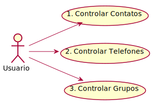

# agenda-db

Agenda eletrônica utilizando JDBC.

Este projeto tem como objetivo ser uma Agenda Eletronica onde podera ser salvo 
os contatos juntamento com os Telefones referentes e separadas por Grupos de Contatos.  

## Começando

Essas instruções fornecerão uma cópia do projeto em execução na sua máquina local para fins de desenvolvimento e teste.

### Pré-requisitos

O que você precisa para executar o software e como instalá-lo

`` ``
 - Instale a versão mais recente do [Java] (https://java.com)
 - Instale a versão mais recente do [Maven] (https://maven.apache.org/download.html).
 - Instale a versão mais recente do InteliJ IDEA.
 - Pode ser necessário definir o seu JAVA_HOME.
 
`` ``

### Executando

Para executar o projeto basta abrir o Intellij e selecionar o projeto, depois navegue ate o arquivo agenda-db\src\main\java\View\Main.java, 
e execute com o comando SHIFT + F0

Termine com um exemplo de como retirar alguns dados do sistema ou usá-los para uma pequena demonstração

### Funcionalidades 

- Inserir Contato : registra um contato, podendo adicionar N telefones 
porem nao podem ser repitidos, 
ou ja estarem cadastrados, 
tambem e possivel vincular a N grupos, 
ou criar um novo grupo e vincular 
ou nao vincular a nenhum grupo 
- Inserir Telefone : registra somente o telefone 
- Inserir Grupo : registra somente o grupo 
- Vincular Telefone com Contato : realiza o vinculo do telefone sem contato 
com algum ja cadastrado contato 
- Desvincular Telefone com Contato : remove o vinculo entre contato e telefone 
- Vincular Contato com Grupo : realiza o vinculo de um contato a um grupo 
- Desvincular Contato com Grupo : remove o vinculo entre contato e grupo
- Listar todos os Contatos : mostra todos os contatos e seus respctivos telefones e grupos
- Listar todos os Telefones : mostra todos os telefones 
- Listar todos os Grupos : mostra todos os grupos
- Buscar contato por Id : contatos e seus respctivos telefones e grupos com base no id digitado
- Buscar contato por Nome : contatos e seus respctivos telefones e grupos com base no nome digitado
- Remover Contato : remove o contato removendo junto o vinculo de telefones e grupos
- Remover Telefone : remove o telefone removendo junto o vinculo com os contatos
- Remover Grupo : remove o grupo removendo junto o vinculo com os contatos
- Listar Contatos por Grupo : mostra os contatos com base no nome do grupo digitado ou ID.

### Caso de uso 

## Construído com

* [Maven] (https://maven.apache.org/) - Gerenciamento de dependências
* [SQLite] (https://www.sqlite.org/index.html) - Banco de dados 

## Controle de versão

Usamos Git para versionar.

## Autores

* ** Gabriel Morara Ribeiro ** 
## Licença

Este projeto está licenciado sob a licença MIT - consulte o arquivo [LICENSE.md] (LICENSE.md) para obter detalhes

